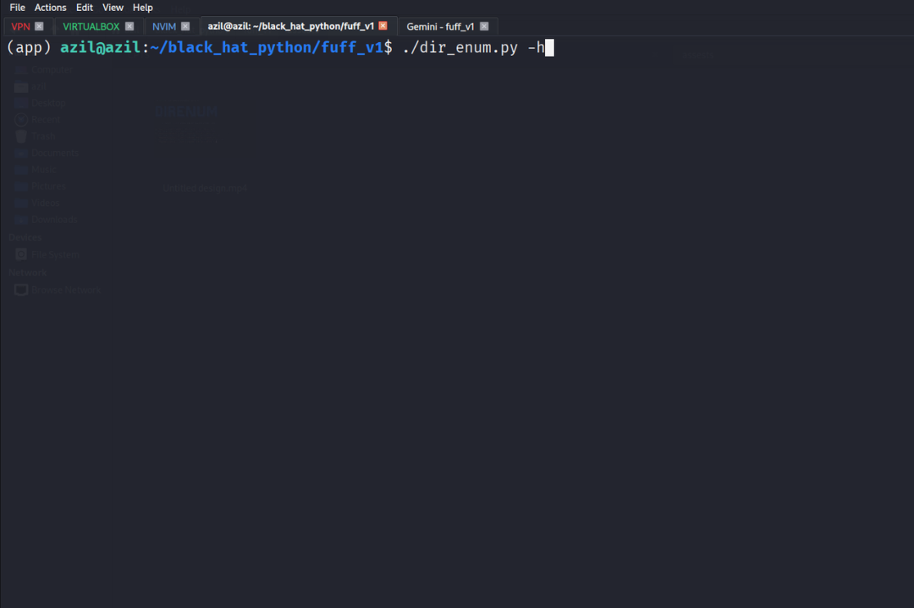
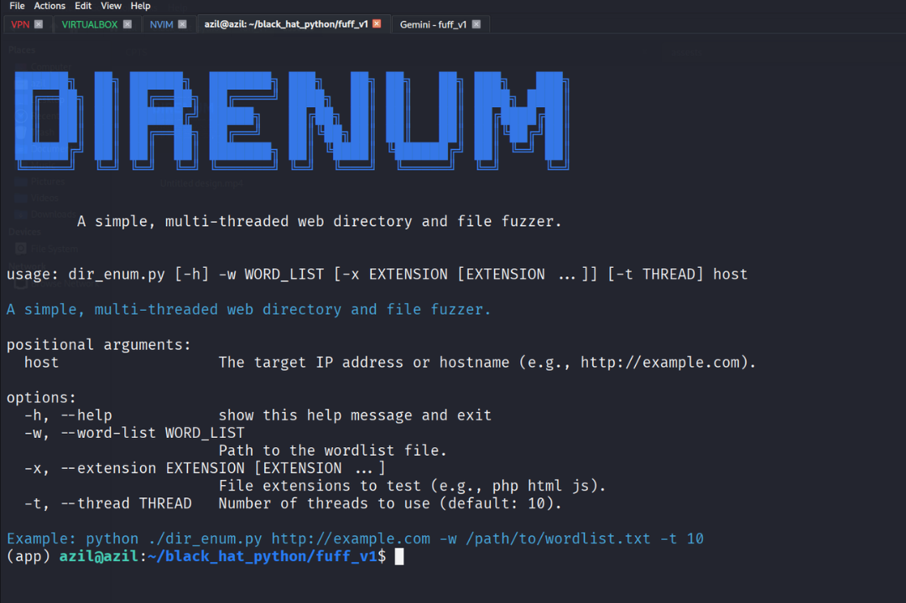

# DirEnum – A Simple Multi-threaded Web Directory & File Fuzzer

`DirEnum` is a fast and lightweight web directory and file brute-forcing tool. It uses multiple threads to quickly test for existing directories and files on a given web server using a wordlist.




---

## Features

* Multi-threaded for faster performance
* Support for file extensions (e.g., `.php`, `.html`, etc.)
* Live progress updates with elapsed time

---

## Requirements

You can install the required modules using:

```bash
pip install -r requirements.txt
```

## Usage

```bash
python3 dir_enum.py <host> -w <wordlist> [-x <ext1> <ext2> ...] [-t <threads>]
```

### Example

```bash
python3 dir_enum.py http://example.com -w /path/to/wordlist.txt -x php html js -t 20
```

### Arguments

| Argument            | Description                                                       |
| ------------------- | ----------------------------------------------------------------- |
| `host`              | Target URL (e.g., `http://example.com`)                           |
| `-w`, `--word-list` | Path to your wordlist file                                        |
| `-x`, `--extension` | (Optional) File extensions to try with each word (e.g., php html) |
| `-t`, `--thread`    | (Optional) Number of threads (default: 10)                        |

---

## Preview


---

## ⚠️ Disclaimer

This tool is intended **only for authorized testing and educational purposes**. Unauthorized scanning of websites is illegal and unethical. Always get proper permission before using.
